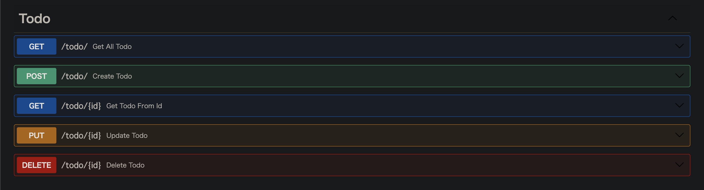
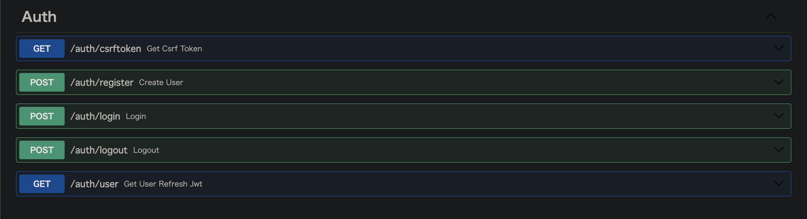

# TodoApp with React + FastAPI

フルスタックアプリ開発の練習

## Frontend (途中...)

* react-routerによるページ遷移
* react-queryによるCRUD
* useContextによるグローバル変数
* TailwindCSSによるスタイリング

## Backend

* ユーザーログイン機能
* CSRFトークンによる認証
* JWT認証
* cookieによるセッション管理
* (未)データベースのasync session

